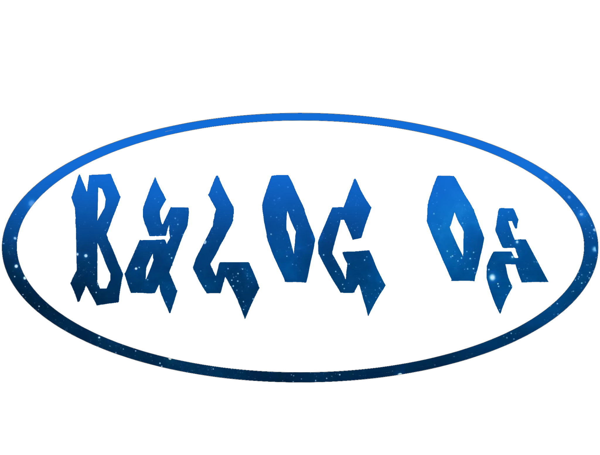

# Balog OS


   _               _____ _____ 
    ____        __               ____  _____
   / __ )____ _/ /___  ____ _   / __ \/ ___/
  / __  / __ `/ / __ \/ __ `/  / / / /\__ \ 
 / /_/ / /_/ / / /_/ / /_/ /  / /_/ /___/ / 
/_____/\__,_/_/\____/\__, /   \____//____/  
                    /____/                  
## Project Overview

Balog OS is a custom operating system project aimed at creating a lightweight, simple, and efficient system focused on physical hardware. The primary philosophy is to develop gradually from basic functionality (keyboard, shell) to more complex features, such as a graphical user interface (GUI) and driver support.

## Table of Contents

- [Architecture](#architecture)
- [Hardware Requirements](#hardware-requirements)
- [Project Goals](#project-goals)
- [Key Components](#key-components)
- [Technical Details](#technical-details)
- [Future Extensions](#future-extensions)
- [Script Structure](#script-structure)
- [Documentation](#documentation)
- [License](#license)

## Architecture

### Target Platform

- **Architecture**: x86_64 (modern 64-bit processors from AMD and Intel)
- **Optimization**: Primarily for physical hardware, secondarily for virtualization platforms (e.g., VirtualBox, QEMU).

### Boot Mechanism

- **Bootloader**: GRUB (Grand Unified Bootloader) for easy system booting.
- **Memory Management**: Basic support during boot (paging, segmentation).

## Hardware Requirements

### Minimum Requirements

- **CPU**: Dual-core processor with 64-bit support.
- **RAM**: 512 MB (for basic OS functions).
- **Disk**: 1–2 GB for the system with a simple GUI.

### Recommended Requirements

- **CPU**: Quad-core or better processor.
- **RAM**: 2–4 GB.
- **Disk**: 10 GB (including space for applications and data).

## Project Goals

### Phase 1: Basic Functionality

- Keyboard Functionality: Detecting user input and transferring data to the system.
- User Data Setup: Ability to enter a name, password, and create a user account.
- Shell: A simple text interface for executing commands.

### Phase 2: Feature Expansion

- File System: Implementation of a simple file system (e.g., FAT32 or custom).
- User Management: Login and management of user accounts.
- Basic GUI: A simple graphical interface with backgrounds and icons similar to XFCE or KDE Plasma.

### Phase 3: Advanced Features

- Multitasking: Process and thread management.
- Drivers: Hardware support, such as graphics cards (VESA framebuffer, OpenGL).
- Compatibility: Experimental support for running .exe files (e.g., using Wine).

## Key Components

### Kernel

- **Type**: Monolithic kernel.
- **Function**: Memory management, process management, file operations, and input/output device management.

### Shell

- **Features**:
  - Command interpreter.
  - Ability to navigate the file system.
  - Basic commands (e.g., ls, cd, mkdir).

### File System

- **Goal**: Incorporate a simple file system (e.g., FAT32) for basic data operations.

### Graphical User Interface (GUI)

- **Base**: Framebuffer (for simple pixel rendering on the screen).
- **Long-term Goal**: Support for OpenGL or other graphical APIs.

## Technical Details

### Memory Management

- Support for paging and virtual memory.
- Separation of kernel space and user space.

### Interrupts

- Setting up the IDT (Interrupt Descriptor Table).
- Support for both hardware and software interrupts.

### Hardware Support

- **Input Devices**: Support for PS/2 and USB keyboards and mice.
- **Graphics**: Basic VESA support for framebuffer.
- **Disks**: AHCI support (for SATA disks).

## Future Extensions

- **Network Support**: Implementation of a TCP/IP stack for communication.
- **Advanced GUI**: Ability to run applications in a custom graphical environment.
- **Virtualization**: Optimization for running on virtualization platforms.

## Script Structure
BalogOS/ ├── boot/ │ ├── grub/ │ │ └── grub.cfg # Configuration file for GRUB │ ├── bootloader.bin # Custom bootloader │ ├── initrd.img # Initial RAM disk │ ├── kernel.img # Kernel image │ └── modules/ # Kernel modules ├── src/ │ ├── kernel/ │ │ ├── memory.c # Memory management │ │ ├── process.c # Process management │ │ └── file.c # File operations │ ├── shell/ │ │ ├── shell.c # Shell implementation │ │ └── commands.c # Command handling │ └── gui/ │ ├── gui.c # GUI implementation │ └── graphics.c # Graphics rendering ├── assets/ │ ├── images/ │ │ └── icon.png # Project icon │ └── fonts/ │ └── default.ttf # Default font └── README.md # Project documentation


Verify

Open In Editor
Run
Copy code

## Documentation

For detailed documentation on how to build and run Balog OS, please refer to the [Documentation](#documentation) section.

## License

This project is licensed under the MIT License. See the [LICENSE](LICENSE) file for more details. ```markdown
# Balog OS
